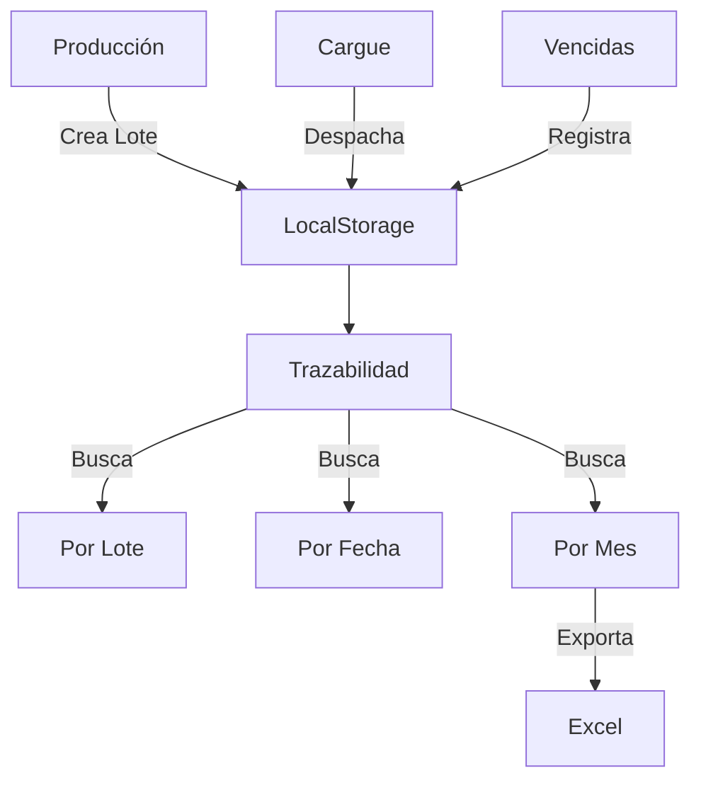

# 📦 MÓDULO DE TRAZABILIDAD DE LOTES

## 📋 Resumen del Proyecto

Sistema completo de trazabilidad de lotes para seguimiento del ciclo de vida de productos desde producción hasta venta/devolución, implementado el **25 de noviembre de 2025**.

---

## 🎯 Objetivo

Crear un módulo integral que permita:
1. Rastrear cada lote desde su creación en producción
2. Seguir su despacho a vendedores
3. Registrar productos vencidos devueltos
4. Generar reportes completos de trazabilidad
5. Exportar información a Excel para análisis

---

## 🏗️ Arquitectura del Sistema

### **1. Fuentes de Datos**

#### **Producción (Origen)**
- **Ubicación:** `Inventario → Producción`
- **Storage:** `localStorage: confirmacion_produccion_{FECHA}`
- **Datos:**
  ```javascript
  {
    lote: "L20251125",
    fechaSeleccionada: "2025-11-25",
    usuario: "Juan",
    productos: [
      { nombre: "AREPA OBLEA", cantidad: 200 },
      { nombre: "AREPA MEDIANA", cantidad: 100 }
    ],
    fechaVencimiento: "2025-12-15"
  }
  ```

#### **Cargue (Despachos)**
- **Ubicación:** `Cargue → Vendedores`
- **Storage:** `localStorage: cargue_{FECHA}`
- **Datos:**
  ```javascript
  {
    fecha: "2025-11-26",
    vendedor: "ID1",
    productos: [
      {
        nombre: "AREPA OBLEA",
        cantidad: 150,
        lotesVencidos: [
          { lote: "L20251125", motivo: "HONGO" }
        ]
      }
    ]
  }
  ```

#### **Vencidas (Devoluciones)**
- **Ubicación:** Dentro de Cargue
- **Campo:** `productos[].lotesVencidos[]`
- **Motivos:** HONGO, FVTO, SELLADO

---

## 🚀 Funcionalidades Implementadas

### **1. Búsqueda por Lote Individual**

**Tab:** "Buscar por Lote"

**Características:**
- Campo de búsqueda con formato automático uppercase
- Timeline visual con eventos del lote
- Resumen estadístico

**Ejemplo de uso:**
```
Input: L20251125
Output: Timeline completo del lote
```

**Visualización:**
```
━━━━━━━━━━━━━━━━━━━━━━━━━━━━━━━━━━━━━
📦 LOTE: L20251125
━━━━━━━━━━━━━━━━━━━━━━━━━━━━━━━━━━━━━

✅ 25/11/2025 08:30 - CREACIÓN
   Usuario: Juan
   Vence: 15/12/2025
   Productos:
   • AREPA OBLEA: 200 unidades
   • AREPA MEDIANA: 100 unidades

📤 26/11/2025 14:00 - DESPACHO
   Vendedor: ID1
   Productos: 150 unidades

⚠️ 27/11/2025 18:00 - RETORNO VENCIDA
   Vendedor: ID1
   Producto: AREPA OBLEA
   Cantidad: 50 unidades
   Motivo: HONGO

━━━━━━━━━━━━━━━━━━━━━━━━━━━━━━━━━━━━━
📊 RESUMEN:
   Producido: 300 ✅
   Despachos: 1 📤
   Unidades Vencidas: 50 ⚠️
```

---

### **2. Historial por Fecha (Día Específico)**

**Tab:** "Historial por Fecha"

**Características:**
- Selector de fecha con calendario
- Tabla con todos los lotes producidos ese día
- Botón para ver trazabilidad completa

**Columnas de la tabla:**
- Lote
- Usuario
- Productos
- Total Producido
- Fecha Vencimiento
- Acción (Ver Trazabilidad)

**Ejemplo:**
```
Fecha seleccionada: 25/11/2025

┌──────────┬─────────┬──────────────┬───────┬──────────┐
│ Lote     │ Usuario │ Productos    │ Total │ Vence    │
├──────────┼─────────┼──────────────┼───────┼──────────┤
│L20251125 │ Juan    │ 3 productos  │  300  │15/12/2025│
│L20251125-│ María   │ 2 productos  │  150  │16/12/2025│
│002       │         │              │       │          │
└──────────┴─────────┴──────────────┴───────┴──────────┘
```

---

### **3. Historial por Mes (Reporte Completo)**

**Tab:** "Historial por Mes"

**Características:**
- Selector de mes y año
- Tabla completa con trazabilidad detallada
- Botón "Exportar a Excel"
- Estados automáticos calculados

**13 Columnas:**
1. # (Índice)
2. Lote
3. Fecha Producción
4. Usuario
5. Producto
6. Cant. Producida
7. Vence
8. Despachado (SÍ/NO)
9. Vendedor
10. Cant. Vencidas
11. Motivo
12. Estado
13. Acción

**Estados Automáticos:**

| Estado | Condición | Color |
|--------|-----------|-------|
| 🟢 EN BODEGA | No despachado | Secondary (Gris) |
| 🔵 EN CIRCULACIÓN | Despachado sin retorno | Info (Azul) |
| 🟡 VENCIDA PARCIAL | Retornó < producido | Warning (Amarillo) |
| 🔴 VENCIDA TOTAL | Retornó = producido | Danger (Rojo) |

**Resumen incluye:**
- Total de lotes producidos
- Total de unidades producidas
- Días productivos del mes

---

### **4. Exportación a Excel**

**Ubicación:** Tab "Historial por Mes" → Botón "Exportar a Excel"

**Características:**
- Genera archivo `.xlsx` con toda la información
- Nombre automático: `Trazabilidad_[mes] de [año].xlsx`
- Columnas ajustadas automáticamente
- Formato profesional

**Estructura del Excel:**

```excel
┌──────────┬─────────┬─────────┬──────────┬──────┬───────┬────────┬────────┬─────────┬───────┬────────┬────────┬─────────┐
│ Lote     │Fecha    │Usuario  │Producto  │Prod. │Vence  │Desp.   │F.Desp. │Vendedor │Venc.  │Motivo  │Cant.V. │Estado   │
│          │Prod.    │         │          │      │       │        │        │         │       │        │        │         │
├──────────┼─────────┼─────────┼──────────┼──────┼───────┼────────┼────────┼─────────┼───────┼────────┼────────┼─────────┤
│L20251125 │25/11/25 │Juan     │AREPA     │ 200  │15/12/ │SÍ      │26/11/25│ID1      │SÍ     │HONGO   │  50    │VENCIDA  │
│          │         │         │OBLEA     │      │2025   │        │        │         │       │        │        │PARCIAL  │
└──────────┴─────────┴─────────┴──────────┴──────┴───────┴────────┴────────┴─────────┴───────┴────────┴────────┴─────────┘
```

---

## 📁 Archivos Creados/Modificados

### **Nuevos Archivos**

1. **`frontend/src/pages/TrazabilidadScreen.jsx`**
   - Componente principal del módulo
   - 850+ líneas de código
   - 3 tabs funcionales
   - Lógica de búsqueda y filtrado
   - Exportación a Excel

2. **`frontend/src/styles/TrazabilidadScreen.css`**
   - Estilos para timeline vertical
   - Animaciones y efectos visuales
   - Diseño responsive
   - Colores temáticos

### **Archivos Modificados**

1. **`frontend/src/App.js`**
   ```javascript
   // Agregado:
   import TrazabilidadScreen from './pages/TrazabilidadScreen';
   
   // Route agregada:
   <Route path="/trazabilidad" element={<TrazabilidadScreen />} />
   ```

2. **`frontend/package.json`**
   ```json
   // Dependencia agregada:
   "xlsx": "^0.18.5"
   ```

---

## 🔧 Tecnologías Utilizadas

- **React** 18.x - Framework frontend
- **React Bootstrap** 2.x - Componentes UI
- **React Icons (FA)** 4.x - Iconografía
- **XLSX** 0.18.5 - Exportación a Excel
- **LocalStorage** - Almacenamiento de datos

---

## 📊 Flujo de Datos



---

## 🎨 Diseño UI/UX

### **Paleta de Colores**

- **Creación:** Verde (#28a745)
- **Despacho:** Azul (#17a2b8)
- **Vencida:** Rojo (#dc3545)
- **Primario:** Azul (#0d6efd)
- **Éxito:** Verde (#198754)

### **Iconografía**

| Elemento | Icono |
|----------|-------|
| Lote | 📦 FaBoxOpen |
| Búsqueda | 🔍 FaSearch |
| Calendario | 📅 FaCalendar |
| Excel | 📄 FaFileExcel |
| Creación | ✅ FaCheckCircle |
| Despacho | 🚚 FaTruck |
| Vencida | ⚠️ FaExclamationTriangle |

---

## 💡 Casos de Uso

### **Caso 1: Auditoría de Lote**
**Usuario:** Gerente de Calidad
**Necesidad:** Verificar qué pasó con un lote específico

**Flujo:**
1. Menú → Trazabilidad
2. Tab "Buscar por Lote"
3. Ingresar: L20251125
4. Ver timeline completo
5. Identificar si hubo vencidas y por qué

---

### **Caso 2: Reporte Diario**
**Usuario:** Supervisor de Producción
**Necesidad:** Ver todos los lotes producidos hoy

**Flujo:**
1. Menú → Trazabilidad
2. Tab "Historial por Fecha"
3. Seleccionar fecha de hoy
4. Ver tabla con todos los lotes
5. Verificar cumplimiento

---

### **Caso 3: Reporte Mensual**
**Usuario:** Gerente General
**Necesidad:** Análisis completo del mes

**Flujo:**
1. Menú → Trazabilidad
2. Tab "Historial por Mes"
3. Seleccionar "Noviembre 2025"
4. Click "Exportar a Excel"
5. Analizar archivo en Excel
6. Identificar patrones de vencidas

---

## ⚙️ Configuración Técnica

### **Estructura de LocalStorage**

```javascript
// Producción
confirmacion_produccion_2025-11-25: {
  lote: "L20251125",
  fechaSeleccionada: "2025-11-25",
  usuario: "Juan",
  productos: [...],
  fechaVencimiento: "2025-12-15"
}

// Cargue
cargue_2025-11-26: {
  vendedor: "ID1",
  productos: [
    {
      nombre: "AREPA OBLEA",
      cantidad: 150,
      lotesVencidos: [
        { lote: "L20251125", motivo: "HONGO" }
      ]
    }
  ]
}
```

### **Funciones Principales**

```javascript
// Búsqueda
buscarLote()                    // Busca lote individual
buscarLotesPorFecha()          // Busca lotes de un día
buscarLotesPorMes()            // Busca lotes de un mes

// Obtención de datos
obtenerLotesProduccion()       // De localStorage producción
obtenerCargues()               // De localStorage cargue
obtenerVencidas(lote)          // Filtra vencidas por lote

// Exportación
exportarTrazabilidadMesExcel() // Genera archivo Excel
```

---

## 📈 Métricas del Módulo

### **Estadísticas de Código**

- **Archivos creados:** 2
- **Archivos modificados:** 2
- **Líneas de código:** ~900
- **Componentes:** 1 principal
- **Funciones:** 7 principales
- **Tabs:** 3
- **Estados:** 8

### **Funcionalidades**

- ✅ Búsqueda por lote
- ✅ Búsqueda por fecha
- ✅ Búsqueda por mes
- ✅ Timeline visual
- ✅ Tablas responsivas
- ✅ Exportación Excel
- ✅ Estados automáticos
- ✅ Resúmenes estadísticos

---

## 🔮 Futuras Mejoras

### **Fase 2 (Pendiente)**

1. **Backend Integration**
   - Migrar de LocalStorage a PostgreSQL
   - Endpoints REST API
   - Autenticación y permisos

2. **Funcionalidades Adicionales**
   - Gráficos de tendencias
   - Alertas de vencimiento
   - Comparativas entre meses
   - Filtros avanzados

3. **Optimizaciones**
   - Paginación en tablas grandes
   - Búsqueda con autocompletado
   - Caché de consultas
   - Lazy loading

4. **Reportes**
   - PDF con timeline
   - Envío por email
   - Programación de reportes
   - Dashboards interactivos

---

## 🐛 Debugging

### **Consola del Navegador**

```javascript
// Ver todos los lotes en producción
for (let i = 0; i < localStorage.length; i++) {
  const key = localStorage.key(i);
  if (key.startsWith('confirmacion_produccion_')) {
    console.log(key, JSON.parse(localStorage.getItem(key)));
  }
}

// Ver todos los cargues
for (let i = 0; i < localStorage.length; i++) {
  const key = localStorage.key(i);
  if (key.startsWith('cargue_')) {
    console.log(key, JSON.parse(localStorage.getItem(key)));
  }
}
```

---

## 📞 Soporte

Para dudas o problemas:
1. Revisar este README
2. Verificar datos en LocalStorage
3. Revisar consola del navegador
4. Verificar que los lotes existan en Producción

---

## ✅ Checklist de Implementación

- [x] Crear página TrazabilidadScreen.jsx
- [x] Crear estilos TrazabilidadScreen.css
- [x] Agregar ruta en App.js
- [x] Instalar librería xlsx
- [x] Implementar búsqueda por lote
- [x] Implementar búsqueda por fecha
- [x] Implementar búsqueda por mes
- [x] Crear timeline visual
- [x] Agregar resúmenes estadísticos
- [x] Implementar exportación a Excel
- [x] Agregar estados automáticos
- [x] Optimizar tabla responsive
- [x] Documentar en README

---

## 📝 Notas Finales

Este módulo fue desarrollado en **una sesión de trabajo** el 25 de noviembre de 2025, implementando un sistema completo de trazabilidad con:

- 3 métodos de búsqueda
- Visualización en timeline
- Tablas completas
- Exportación profesional
- Estados automáticos
- Diseño responsive

**Tiempo de desarrollo:** ~2 horas
**Estado:** ✅ Funcional y listo para uso

---

*Última actualización: 25 de noviembre de 2025 - 23:42*
